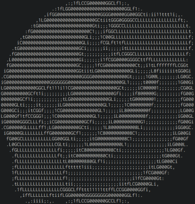

# cimage

View image file using ASCII character

Input | Output
------|-------
 | 

Supported image formats:
```
JPEG baseline & progressive (12 bpc/arithmetic not supported, same as stock IJG lib)
PNG 1/2/4/8/16-bit-per-channel
TGA (not sure what subset, if a subset)
BMP non-1bpp, non-RLE
PSD (composited view only, no extra channels, 8/16 bit-per-channel)
GIF (*comp always reports as 4-channel)
HDR (radiance rgbE format)
PIC (Softimage PIC)
PNM (PPM and PGM binary only)
```

## Usage

```sh
cimage.py [-w WIDTH] [-h HEIGHT] [-f] [-t TONE] [-i] filename
```

Option       | Description
-------------|------------
-w, --width  | Specify number of columns<br>Default value: min(Original width, 80)
-h, --height | Specify number of rows
-f, --frame  | Display a frame around the image
-t, --tone   | Specify a custom tone string like `" .,:;8#"`
-i, --invert | Invert the tone of image

Note:  
* If only `-w` or `-h` is specified, the aspect ratio of output image will be keep.

Example of use:  
```sh
# Specifying width and height
$ cimage.py emoji.png -w 50 -h 10
iiiiiiiii1ttfLLCCCG00000GGCCG0GCCLLLfttttttttt11ii
iiii1tfLCGGG000000000GCf1i1fCCLLLLLLLLLLLLLLLLLfft
i1fLGG00000000000000Gt;;;i1tttfLCCCLffffLLLLLLLLLt
fC0000000000GGGGGG00CttfLCCGGG0GGLt1i1fGL1111tCGGf
G000GGCLLfft1111tCG00000000GCLf1i1tLG8@8t;;;;;tG0G
G00GLtttfLt;;1fCGG000GGCLft111fC08@@8Gfi;;;;;;tG0G
fC00GCLLLLftfCGGGCLftt11tfC08@@@8GLti;;;;;;;ifG0Cf
i1fCLLLLLLLLLLLf11tfLCG0000GCft1i;;;;;;;i1fLGGCf1i
ii1fLLLLLLLLLLLLf111111ii;;;;;;;iii1tfLLCCLft1iiii
iii1ttfffLLfffffLLLLLLLffLLLLLCLLLLLLftt1iiiiiiiii

# Using custom tone string
$ cimage.py emoji.png -w 50 -t " 123745689"
33333333333337744558888888888885544773333333333333
33333333337456688888888888666888886654744444447733
33333333756688888888888864775866665555555555555473
33333375688888888888888572275655555555555555555547
33337568888888888888885323466545555555555555555555
33346888888888888888853223447337455555555555555555
33468888888888888888672222233745665555555555555547
34688888888888888888532237456688886577445555555653
76888888888888888888533756888888865322355777746867
58888888888888888888666688888888643227696322235885
88888888866654444568888888888865322348995222224688
88888866473332223468888888886573227699997222227688
88886573233222275688888888664322359999953222227688
88867237465323468888888866432235899999532222227688
88865556564224688888886543223489999994322222234888
58888665554376888888657322348999999672222222276885
76886655555456888654332375899999984322222222358867
34686555555555664732237699999996432222222223588643
33465555555555572237589999998573222222222275886433
33745555555555547469999886473222222222223468864333
33745555555555554444477332222222222223346886573333
33755555555555554322222222222222223375688657333333
33745555555555554733322222223337745668665733333333
33374455555555566665555444555566688665473333333333
33333744455444744558888888888885544773333333333333
```

## Setup

1. Build `imageutil/build/libimageutil.so`

    ```sh
    $ mkdir imageutil/build
    $ cd imageutil/build
    $ cmake ..
    $ make
    ```

## License

MIT License

